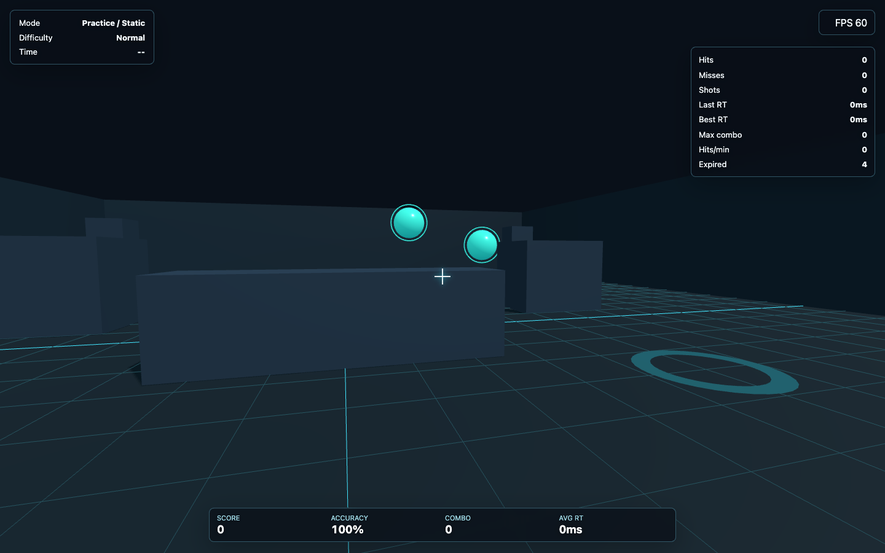

# FPS Aim Arena



FPS Aim Arena is a browser-only three.js sports trainer for reaction speed, pointing precision, and first-person camera control. It uses abstract hologram targets, clean arena geometry, and visual-only feedback. It does not include real firearm names, realistic weapon modeling, human targets, enemies, military scenarios, blood, injury, or tactical training content.

Public URL: https://sudoyan118.github.io/fps-aim-arena/

## Features

- three.js first-person SF/sports training arena with floor, walls, columns, obstacles, spawn pads, and arena bounds.
- WASD movement, mouse look, Space jump, Shift dash, Esc pointer unlock, and automatic reset if the player leaves bounds.
- Center crosshair with three styles, hit/miss feedback, Raycaster hit detection, and lightweight ring effects.
- Static, moving, popup, and mixed target modes.
- Practice mode and timed challenge mode with 30s/60s timer selection.
- Start-screen mouse sensitivity slider from 0.40x to 2.50x.
- Easy, Normal, Hard, and Expert difficulties that change target size, spawn interval, lifetime, movement speed, and simultaneous targets.
- HUD with mode, difficulty, timer, FPS, score, hits, misses, accuracy, combo, max combo, reaction times, hits per minute, and expired targets.
- GitHub Actions workflow for automatic GitHub Pages deployment from `main`.

## Controls

| Input | Action |
| --- | --- |
| WASD | Move |
| Mouse move | Look |
| Start slider | Adjust mouse sensitivity |
| Left click | Hit/select target |
| Space | Jump |
| Shift | Dash |
| R | Reset session |
| F | Toggle Practice / Challenge |
| 1 / 2 / 3 / 4 | Static / Moving / Popup / Mix target mode |
| Q / E | Decrease / increase difficulty |
| Tab | Toggle detailed stats panel |
| Esc | Unlock pointer |
| C | Change crosshair |
| Timer button / T | Toggle 30s / 60s challenge timer |

## Local Development

```bash
npm install
npm run dev
```

Open `http://127.0.0.1:5173/`.

## Build

```bash
npm run build
```

The Vite base path is configured for GitHub Pages subpath deployment as `/fps-aim-arena/` when `GITHUB_REPOSITORY` is set.

## CI/CD

`.github/workflows/deploy-pages.yml` runs on pushes to `main`.

1. Install dependencies with `npm ci`.
2. Build with `npm run build`.
3. Upload `dist`.
4. Deploy to GitHub Pages with `actions/deploy-pages`.

## QA Summary

Local Playwright QA confirmed:

- Initial overlay, arena canvas, targets, HUD, crosshair, FPS, initial mode, and initial difficulty render without console errors.
- WASD movement, mouse look, Space jump, Shift dash, R reset, Tab stats toggle, C crosshair toggle, Esc pointer unlock, mode keys 1-4, F Practice/Challenge toggle, Q/E difficulty changes, and timer toggle.
- Static, moving, popup, and mix target modes spawn expected target types.
- Moving target position changes smoothly over time.
- Popup target expiry is counted as a miss.
- Target hit increases hits, score, combo, average reaction time, and visual hit toast.
- Empty click increases misses, lowers accuracy, and resets combo.
- Challenge timer decreases and shows a result panel at the end.
- Wide and portrait viewport resize keeps canvas matched to viewport and HUD readable.

Visual QA confirmed from Playwright screenshots:

- Clean SF/sports arena appearance with grid floor, walls, obstacles, spawn pads, hologram targets, central crosshair, and readable HUD.
- Targets are visually distinct from the background.
- Wide viewport does not show HUD overlap.
- Portrait viewport remains usable after mobile HUD adjustment.

Screenshots:

- `public/screenshots/arena-preview.png`
- `.playwright-cli/page-2026-06-07T07-41-29-330Z.png` for portrait visual QA
